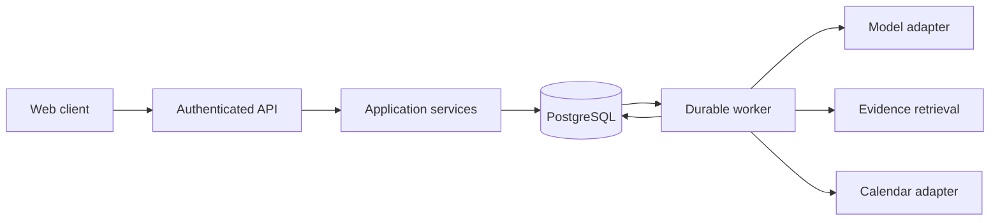

# Architecture

Status: proposed design; no runtime components are implemented.

## System shape

Start with a modular monolith, PostgreSQL, and a separately runnable worker using the same application services. A responsive TypeScript web client and a typed Python API are the proposed implementation stack. Record concrete framework and dependency decisions before adding them. Avoid microservices, Kubernetes, and a multi-agent topology until evidence warrants their operational cost.

## Boundaries

- Domain: facts, constraints, plan versions, approvals, and operation transitions. No model SDK, HTTP, or database dependencies.
- Application: use cases, authorization checks, unit-of-work boundaries, and orchestration.
- Adapters: persistence, model providers, retrieval, calendar, and notifications.
- Delivery: HTTP contracts, streaming, worker entry points, and client views.

Use explicit interfaces at external boundaries. Do not abstract every function or introduce speculative providers. Keep orchestration readable and bounded by deadlines, tool-call limits, and token/cost budgets.

## Data model

Keep User, Consent, MemoryFact, Observation, Goal, PlanVersion, PlanItem, EvidenceReference, Approval, ToolOperation, and ExternalResourceMapping distinct. User-owned entities carry an owner identifier enforced at every access path. Memory records include provenance, observed/recorded time, validity, and confirmation status. Store UTC instants with IANA time-zone context for schedules; retain original units and measurement times for observations.

Plans reference the facts and evidence used to produce them. Inferred preferences remain proposals until confirmed. Concurrent edits use version checks. Export and deletion include derived retrieval records and cached user context, with separately documented backup retention.

## External execution

Proposed operation states: proposed, awaiting_confirmation, queued, executing, succeeded, failed, cancelled, and outcome_unknown. Define allowed transitions and persistence semantics in the first implementation slice.

1. Persist a validated proposal and its exact payload version.
2. Bind user confirmation to that version, operation scope, and expiration.
3. Atomically record the executable operation and queue/outbox entry.
4. Claim work with a lease and persist attempt metadata.
5. Apply provider-supported idempotency or stable resource identifiers.
6. On an ambiguous response, reconcile the provider state before retrying a write.
7. Persist a verified result and expose structured status to the client.

Do not claim exactly-once delivery across a database and an external API. Design for at-least-once delivery with deduplication and reconciliation. An expired lease is not evidence that an external write failed. Cancellation after a confirmed remote write may require a separately authorized compensating action.

Calendar access defaults to an assistant-owned calendar and neutral event titles. Do not edit unrelated events. A changed proposal invalidates its earlier confirmation. Revoked credentials stop execution without retry storms.

## Evidence and health policy

Separate public knowledge from private memory. Retrieved documents and tool output are untrusted data and cannot authorize actions. Retain source, passage, retrieval time, and applicable publication metadata. Check whether cited evidence supports a claim; a valid URL alone is insufficient. Health-risk handling precedes ordinary coaching and remains subject to separate evaluation and expert review.

## Reliability and scale

Stateless API instances and durable worker leases allow independent scaling. Begin with a database-backed job mechanism; introduce a separate broker only after measuring contention and throughput. Bound provider concurrency per user and per provider. Use timeouts, backoff with jitter, retry budgets, and admission control. Document queue behavior under overload and partial outages.

Record correlation identifiers, transition events, provider latency, queue age, usage, and categorized failures. Exclude raw health content, tokens, and credentials from default logs. Distinguish time to first token, full response latency, and operation completion time. Set performance targets only with a defined workload and environment.

## Unresolved decisions

Authentication provider, model provider, knowledge-source licensing, hosting, queue library, and numeric service objectives remain open. Resolve each with a small experiment and an architecture decision record, including alternatives and consequences.
