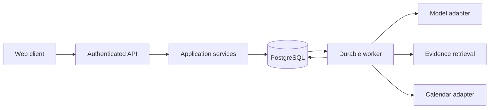

# Architecture

Status: the domain layer, the persistence adapter, and the worker's claiming use
cases are implemented and tested (`src/health_assistant/domain`,
`src/health_assistant/adapters/persistence`, `src/health_assistant/application`).
Users, plans, plan versions, plan items, constraints, approvals, approved
actions, and operations are stored. Delivery, model providers, evidence
retrieval, and calendar execution remain proposed design with no runtime
components; the provider is simulated.

## System shape

Start with a modular monolith, PostgreSQL, and a separately runnable worker using the same application services. A responsive TypeScript web client and a typed Python API are the proposed implementation stack. Record concrete framework and dependency decisions before adding them. Avoid microservices, Kubernetes, and a multi-agent topology until evidence warrants their operational cost.

## Boundaries

- Domain: facts, constraints, plan versions, approvals, and operation transitions. No model SDK, HTTP, or database dependencies.
- Application: use cases, authorization checks, unit-of-work boundaries, and orchestration.
- Adapters: persistence, model providers, retrieval, calendar, and notifications.
- Delivery: HTTP contracts, streaming, worker entry points, and client views.

Use explicit interfaces at external boundaries. Do not abstract every function or introduce speculative providers. Keep orchestration readable and bounded by deadlines, tool-call limits, and token/cost budgets.

## Data model

Keep User, Consent, MemoryFact, Observation, Goal, Constraint, PlanVersion, PlanItem, EvidenceReference, Approval, ToolOperation, and ExternalResourceMapping distinct. User-owned entities carry an owner identifier enforced at every access path. Memory records include provenance, observed/recorded time, validity, and confirmation status. Store UTC instants with IANA time-zone context for schedules; retain original units and measurement times for observations.

Plans reference the facts and evidence used to produce them. Inferred preferences remain proposals until confirmed. Concurrent edits use version checks.

A plan version is identified by its plan and version number, and carries the
version it revises. A successor is only valid on top of its own stored parent,
which the schema enforces with a self-referencing foreign key so that no code
path can create a version whose history is missing. Uniqueness alone would
accept version 3 written directly onto version 1. Export and deletion include derived retrieval records and cached user context, with separately documented backup retention.

## Constraint validation

A constraint is a distinct entity, not a flavor of memory fact, because a
deterministic check stands between any generated proposal and the approval that
authorizes external execution. `validate_plan` matches normalized tokens and
time intervals only; no model call participates, so the same plan and constraint
set always produce the same findings.

Severity and confirmation are independent. A hard constraint the user stated
yields a violation; the same constraint inferred but unconfirmed yields a
clarification requirement. Both block approval, so an unconfirmed inference is
neither silently enforced nor silently ignored. `grant_approval` performs this
validation itself, which means no execution path can obtain an approval for a
plan that violates a hard constraint. See
[ADR 0002](decisions/0002-first-class-constraints.md).

Items with a reported outcome are history and are not revalidated. Recording a
constraint today must not retroactively invalidate what already happened.

## External execution

Operation states: proposed, awaiting_confirmation, queued, executing, succeeded,
failed, cancelled, and outcome_unknown. Allowed transitions are implemented as
data in `health_assistant.domain.operations.ALLOWED_TRANSITIONS`; persistence
semantics remain proposed until Sprint 2.

1. Persist a validated proposal and its exact payload version.
2. Bind user confirmation to that version, the specific external action, the operation scope, and an expiration.
3. Atomically record the executable operation and queue/outbox entry.
4. Revalidate authorization at the execution boundary before claiming work: a
   confirmation can expire or be revoked while the operation sits in the queue.
5. Claim work with a lease and persist attempt metadata.
6. Apply provider-supported idempotency or stable resource identifiers.
7. On an ambiguous response, reconcile the provider state before retrying a write.
8. Persist a verified result and expose structured status to the client.

Do not claim exactly-once delivery across a database and an external API. Design for at-least-once delivery with deduplication and reconciliation. An expired lease is not evidence that an external write failed. Cancellation after a confirmed remote write may require a separately authorized compensating action.

An approval names the action it authorizes, not only the item, so a confirmation
to create an event cannot authorize cancelling it; see
[ADR 0003](decisions/0003-authorization-boundary.md).

Calendar access defaults to an assistant-owned calendar and neutral event titles. Do not edit unrelated events. A changed proposal invalidates its earlier confirmation. Revoked credentials stop execution without retry storms.

## Evidence and health policy

Separate public knowledge from private memory. Retrieved documents and tool output are untrusted data and cannot authorize actions. Retain source, passage, retrieval time, and applicable publication metadata. Check whether cited evidence supports a claim; a valid URL alone is insufficient. Health-risk handling precedes ordinary coaching and remains subject to separate evaluation and expert review.

## Reliability and scale

Stateless API instances and durable worker leases allow independent scaling. Begin with a database-backed job mechanism; introduce a separate broker only after measuring contention and throughput.

Claiming uses `SELECT ... FOR UPDATE SKIP LOCKED`, so a second worker passes over
a held row instead of waiting behind it. Whether a claimed row may execute stays
the domain's decision rather than the query's, and the worker's cross-user scan
is the single access path not scoped to an owner. See
[ADR 0005](decisions/0005-worker-claiming.md). Bound provider concurrency per user and per provider. Use timeouts, backoff with jitter, retry budgets, and admission control. Document queue behavior under overload and partial outages.

Record correlation identifiers, transition events, provider latency, queue age, usage, and categorized failures. Exclude raw health content, tokens, and credentials from default logs. Distinguish time to first token, full response latency, and operation completion time. Set performance targets only with a defined workload and environment.

## Unresolved decisions

Authentication provider, model provider, knowledge-source licensing, hosting, queue library, and numeric service objectives remain open. Resolve each with a small experiment and an architecture decision record, including alternatives and consequences.
